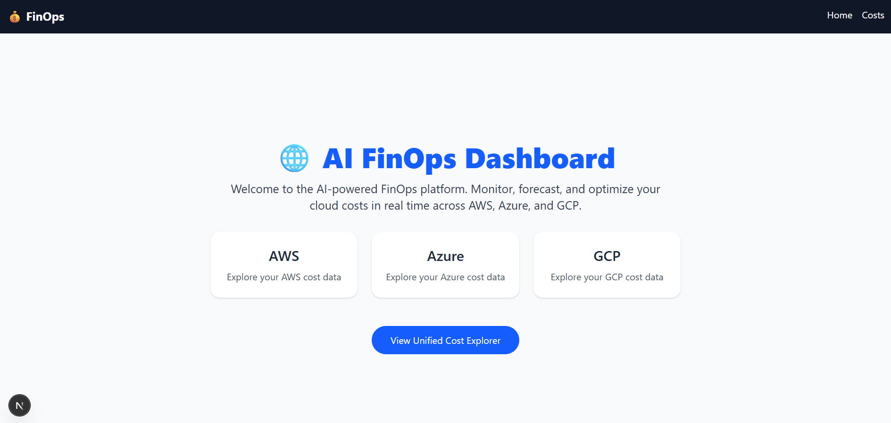
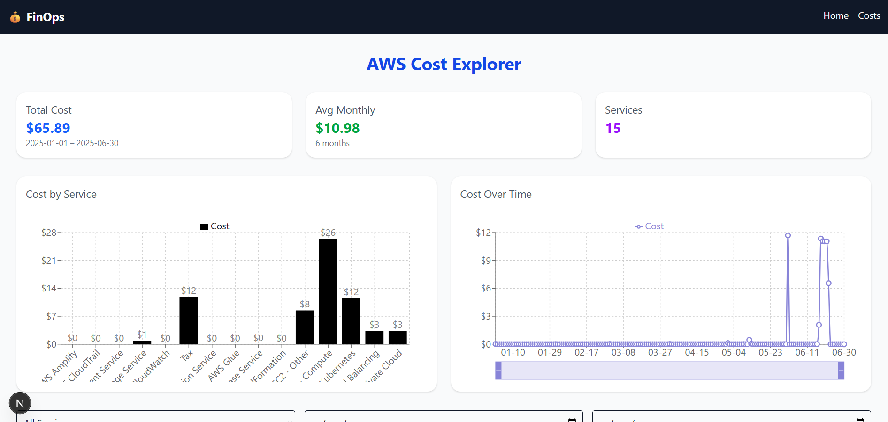

# AI FinOps Platform

## 🚀 Tech Stack Badges


---

## 📖 Overview

**AI FinOps Platform** is an AI-powered platform for cloud cost optimization and forecasting. Built with FastAPI, Python, and modern MLOps tools, it allows teams to track multi-cloud usage (AWS, Azure, GPC), detect anomalies, and predict future expenses using real-time data and machine learning.

Key features:

- Unified ingestion pipelines for each provider
- Powerful REST API with FastAPI & OpenAPI docs
- Interactive React dashboard (Next.js + TailwindCSS)
- ML-driven forecasting & anomaly detection
- Full IaC deployment via Terraform & Helm

### Recent UI Updates




---

## 🧱 Tech Stack

### Infrastructure & DevOps
- Terraform (infrastructure provisioning)
- Kubernetes + Helm (orchestration)
- Docker (containerization)
- GitHub Actions (CI/CD)
- Prometheus + Grafana (monitoring)
- Cloud Billing APIs (AWS, Azure, GCP)

### Backend
- Python (FastAPI)
- PostgreSQL (relational DB)
- InfluxDB (time series data)

### AI/ML
- Forecasting: XGBoost, statsmodels
- Clustering: KMeans
- Anomaly Detection: Isolation Forest, Autoencoders
- Recommendation: Reinforcement Learning models

### Frontend
- React + TailwindCSS (Next.js)
- Data visualization with Recharts / Chart.js

---

## 🎯 Objectives
- Optimize cloud resource usage and cost efficiency
- Predict monthly spending using machine learning
- Detect anomalous cost spikes and resource misusage
- Provide actionable AI-based cost-saving recommendations
- Offer a user-friendly dashboard for Finance & Tech teams

---

## 🆕 Changelog

### July 2025 Updates

- **Enhanced API docs** with detailed parameter descriptions & examples
- **Ingestion**: Added per-provider scripts, unified CSV loader and header-only fallback
- **Makefile**: New targets for `ingest-api`, `fetch-aws`, `fetch-azure`, `fetch-gcp`
- **Infrastructure**: Updated Terraform modules partially.
- **Security**: Enforced CORS policies and OAuth2/JWT authentication on backend
- **User Manual**: Expanded with Docker Compose, Jupyter, and CLI workflows

### June 2025 Updates

- Added `provider` field to all cost endpoints and UI filters
- Switched to stacked bar & multi-series line charts for richer insights
- Introduced infinite scroll and deduplication in cost tables
- Proxying `/docs` & `/redoc` through Next.js for consolidated UX
- Updated complete Helm modules for deployment in AWS.

---

## 🚀 Quick Start

```bash
# 1. Clone repo
git clone https://github.com/Impesud/ai-finops-platform.git
cd ai-finops-platform

# 2. Setup venv & install
make init

# 3. Ingest sample data
make fetch-aws
make fetch-azure
make fetch-gcp
# or via API
make ingest-api

# 4. Run app
make dev

# 5. Explore
- Dashboard: http://localhost:3000
- Swagger:   http://localhost:3000/docs
- ReDoc:     http://localhost:3000/redoc

# 6. Deploy Pipeline on AWS (Helm + EKS)
make full-setup #To provision the full environment (EKS cluster, IAM, ALB controller, Helm setup, etc.)
make deploy #To deploy or update the platform on an existing cluster (after building & pushing images)
```

---

## 📂 Repository Structure

```
app/           # FastAPI backend
frontend/      # Next.js dashboard
services/      # ETL & ingestion modules
scripts/       # Ingestion & deployment scripts
notebooks/     # ML notebooks
infra/         # Terraform & Helm
app/data/      # Generated CSVs
docs/          # Documentation & images
tests/         # Pytest suites
Makefile       # Task automation
README.md      # Project overview
```

---

**Maintainer:** Erick Jara — CTO & AI/Data Engineer\
📧 [erick.jara@hotmail.it](mailto\:erick.jara@hotmail.it) | 🌐 GitHub: [Impesud](https://github.com/Impesud)